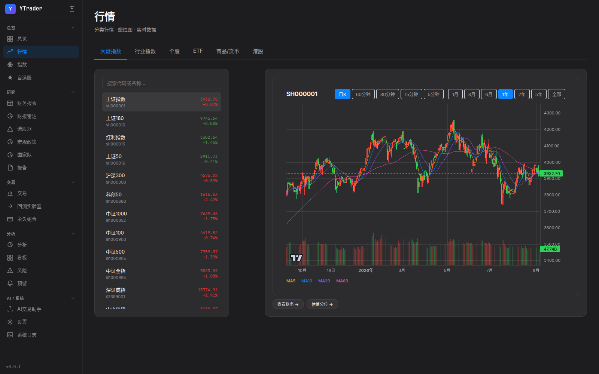
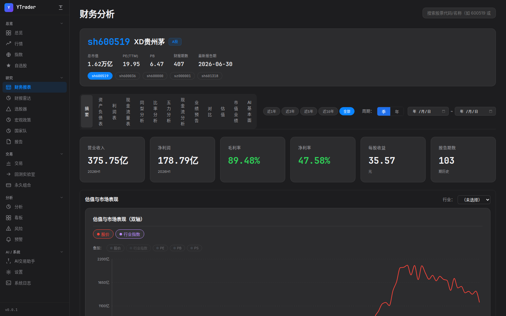
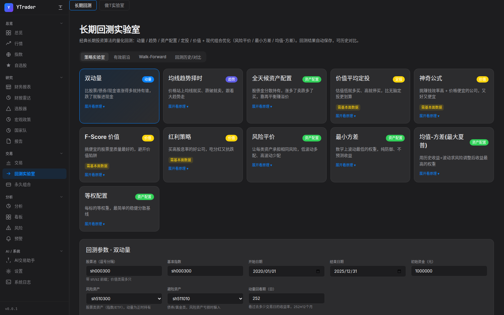
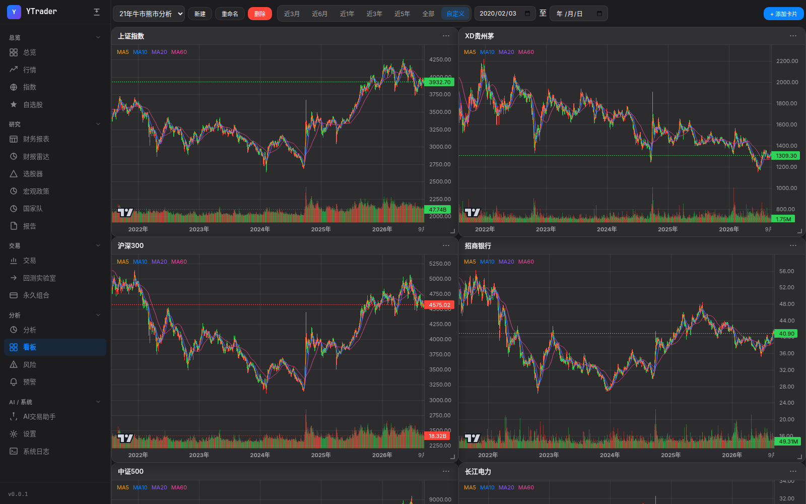
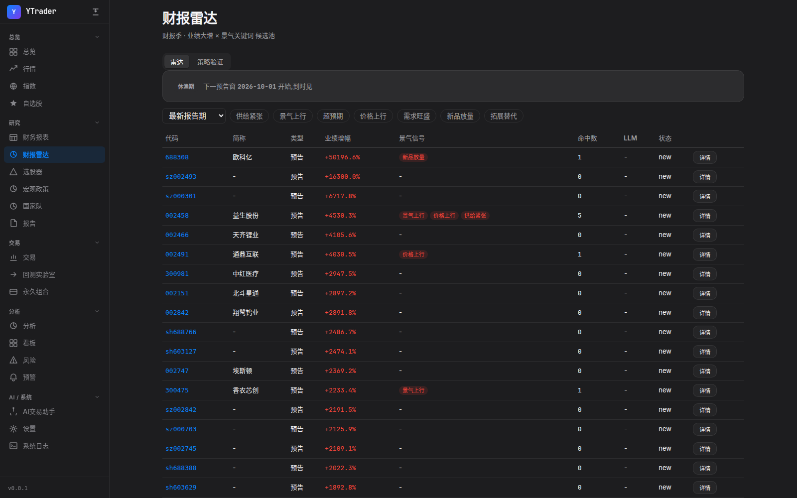

# YTrader — A 股价值投资研究一站式平台


**免费、开源、开箱即用**——行情、财报、估值、回测、AI 分析,一个应用全都有。为**长期投资 / 价值投资**工作流打造,量化交易策略持续演进。数据全部来自公开免费源(腾讯行情、AkShare、巨潮资讯),不用注册、不用 token,clone 下来就能跑。

> 🎯 **项目立场**:为价值投资与稳定盈利的方式持续投入;有优秀策略欢迎共享——[提 Issue](https://github.com/ydonghao/ytrader/issues) 即可参与共建。



## 💡 为什么选 YTrader

对标理杏仁这类付费数据平台,YTrader 的核心差异是**免费、开源、数据完全归你**:

| 能力 | 理杏仁等付费平台 | YTrader |
|---|---|---|
| 费用 | 会员制,高级数据按量计费 | **免费 + MIT 开源** |
| 数据归属 | 平台云端,导出受限 | **全量明细落在你本地 PostgreSQL**,SQL 自由分析、永久持有 |
| 估值工具 | PE/PB 分位查询 | **五法估值中心**:DCF / DDM / 净资产 / 类比同行 / 乘数分位,五种方法交叉验证 |
| 财报分析 | 数据查询为主 | 三表 + 比率 + 共同比 + 现金流质量一体分析 |
| 财报季情报 | — | 景气雷达:业绩预告扫描 + 景气关键词归类 + LLM 深度解读 |
| 回测验证 | — | 回测实验室:A 股真实约束(T+1/涨停跳过)、walk-forward |
| AI 能力 | — | 任意 OpenAI 兼容大模型接入,盘中研究副驾驶 |
| 使用门槛 | 注册即用 | 需本地部署(Docker 4 步,约 10 分钟) |

**诚实的边界**:理杏仁们即开即用、覆盖多市场、数据有人工校验,这些是它们的价值;YTrader 适合愿意花 10 分钟自建、想要数据与分析完全自主的深度投资者。

**路线图**:当前聚焦长期投资 / 价值投资工作流(估值分位、财报质量、景气跟踪);量化交易策略线(多因子、策略库)将在后续版本逐步增强。

## ✨ 它能做什么

5 大板块 20 个功能页,覆盖 A 股研究的完整链路:

| 板块 | 页面 | 亮点 |
|---|---|---|
| 📊 总览 | 行情 / 指数 / 自选股 | 实时行情 + K 线(多窗格技术指标 BOLL/MACD/RSI),WebSocket 推送,自选分组管理 |
| 🔍 研究 | 财务报表 / 财报雷达 / 选股器 / 宏观政策 / 国家队 / 报告 | 财务三表 + **五法估值中心**;财报季景气雷达;基本面条件选股;中央汇金持仓全景 |
| 📈 交易 | 交易 / 回测实验室 / 永久组合 | 多策略回测、参数优化、有效前沿、walk-forward 验证、业绩归因 |
| 🧮 分析 | 分析 / 看板 / 风险 / 预警 | 持仓收益统计、多股对比、月度热力图、相关性矩阵、风险指标 |
| 🤖 AI | AI 交易助手 / 设置 / 日志 | OpenAI 兼容协议接入,盘中辅助分析、宏观解读 |

### 招牌功能

- **五法估值中心**:DCF 现金流折现、DDM 股利折现、净资产分析、类比同行、乘数历史分位——五种方法互相交叉验证,不再依赖单一估值数字
- **财报雷达**:财报季自动扫描业绩预告,按"供给紧张 / 景气上行 / 超预期"等景气关键词归类打分,支持 LLM 深度解读与策略回测验证
- **回测实验室**:T+1 规则、涨停跳过等 A 股真实约束内置;净值对比、分年统计、月度热力图一应俱全
- **国家队追踪**:中央汇金等机构的持仓变动全景追踪
- **AI 交易助手**:接任意 OpenAI 兼容大模型(智谱 / MiniMax / DeepSeek / OpenAI……),做你的盘中研究副驾驶

<details>
<summary>📸 更多截图(财务分析 / 回测 / 持仓看板 / 财报雷达)</summary>

| 财务报表与估值中心 | 回测实验室 |
|---|---|
|  |  |

| 持仓分析看板 | 财报雷达 |
|---|---|
|  |  |

</details>

## 🚀 快速开始(约 10 分钟)

### 第 0 步:装好三样东西

| 工具 | 用途 | 安装 |
|---|---|---|
| [Docker](https://docs.docker.com/get-docker/) | 跑数据库 | 按官网装 Docker Desktop 即可 |
| Python 3.13 + [uv](https://docs.astral.sh/uv/) | 跑后端 | `curl -LsSf https://astral.sh/uv/install.sh \| sh` |
| Node.js ≥ 21 + pnpm | 跑前端 | 装 Node 后 `npm i -g pnpm` |

### 第 1 步:起数据库(一行命令)

```bash
docker run -d --name ytrader-db \
  -p 5432:5432 \
  -e POSTGRES_USER=postgres \
  -e POSTGRES_PASSWORD=postgres \
  -e POSTGRES_DB=ytrader \
  timescale/timescaledb:latest-pg17
```

账号密码和项目默认配置(`backend/conf/config.yaml`)自动对上,不用改任何东西。首次启动后端会自动建表。

### 第 2 步:准备配置文件

```bash
cp .env.example .env
```

**所有 key 都可以先不填**——行情、财报、估值、回测等核心功能用免费公开数据源,零配置可用。AI 功能以后再配也来得及。

### 第 3 步:一键启动

```bash
./dev-start.sh
```

这个脚本会:自动装前后端依赖 → 启动后端(:12100)→ 启动前端(:12000)。

### 第 4 步:打开浏览器

访问 **http://localhost:12000** ——完事!

> 💡 首次启动会自动拉取指数与行业基础数据,页面数据逐步填充,属正常现象;行情为腾讯免费实时源。

### (可选)开启 AI 功能

在 `.env` 里填入任意一家 OpenAI 兼容服务的 key(如 `MINIMAX_API_KEY`),或启动后在 **设置** 页面里配置。不配也不影响其他功能。

## ❓ 常见问题

<details>
<summary><b>端口被占用了怎么办?</b></summary>

`dev-start.sh` 会自动清理 12000/12100 端口上的旧进程。若仍冲突,在 `.env` 里改 `BACKEND_PORT` / `FRONTEND_PORT`。
</details>

<details>
<summary><b>git status 显示 backend/conf/config.yaml 被改了,是我弄坏了吗?</b></summary>

不是。首次启动时后端会自动生成一个加密用的 `encryption_key` 写回该文件,属于设计内行为,不影响使用。
</details>

<details>
<summary><b>数据收费吗?需要注册账号吗?</b></summary>

不需要。行情来自腾讯公开接口,财报与公告来自 AkShare / 巨潮资讯,全部免费、无需 token。AI 功能用的 LLM key 需自备。
</details>

<details>
<summary><b>不想等首次回填?可直接导入历史数据包(约 1.8GB,含 10 年估值/财报/日K)</b></summary>

从 [Releases · data-2026-09](https://github.com/ydonghao/ytrader/releases/tag/data-2026-09) 下载两个 `.sql.zst` 文件,在**首次启动应用之前**导入数据库:

```bash
zstd -dc ytrader-value-data-2026-09.sql.zst  | docker exec -i ytrader-db psql -U postgres -d ytrader
zstd -dc ytrader-daily-ohlcv-2026-09.sql.zst | docker exec -i ytrader-db psql -U postgres -d ytrader
```

包含截至 2026-09 的个股每日估值(1035 万行)、财务明细、业绩预告、指数/申万行业数据与日 K 线(2840 万行)。数据来自公开接口,仅供学习研究。
</details>

<details>
<summary><b>支持 Windows 吗?</b></summary>

`dev-start.sh` 是 bash 脚本,Windows 用户推荐在 WSL 里运行;也可以按 [backend/README.md](backend/README.md) 与 [frontend/README.md](frontend/README.md) 手动分别启动,效果相同。
</details>

<details>
<summary><b>为什么涨是红色、跌是绿色?</b></summary>

A股约定俗成红涨绿跌,本项目遵循该口径。
</details>

## 🤝 参与贡献:提 Issue 就行,不用写代码

本项目采用 **AI 驱动开发**模式:所有代码由我和 AI 协作完成,所以参与项目**完全不需要会写代码**:

1. 有任何需求、想法、bug,直接[提一个 Issue](https://github.com/ydonghao/ytrader/issues)
2. 说清楚你想要什么——期望的效果、使用场景、示例截图,越具体越好
3. 我会用 AI 实现 Issue 中的需求并合入主干

不需要 fork、不需要改代码、不需要提 PR——把问题留给 Issue,把实现交给 AI。

**特别欢迎共享优秀策略**:你有经过验证的投资策略、选股思路、估值打法?直接提 Issue 说明逻辑与回测依据——策略即贡献,无需代码,好策略会被实现进策略库并署名致谢。⭐ 如果这个项目对你有帮助,欢迎点个 star 让更多人看到。

## 🏗 技术架构(给想深挖的同学)

| 层 | 技术 |
|---|---|
| 后端 | Python 3.13、FastAPI、SQLModel(无 Alembic,启动自动建表)、PostgreSQL + TimescaleDB、LangChain、APScheduler |
| 前端 | React 18、TypeScript、Rsbuild、Zustand、recharts、Rush monorepo |
| 数据源 | 腾讯行情(实时/K线)、AkShare(财报/宏观)、巨潮资讯(公告)、NewsNow/RSSHub(资讯,可选) |

后端 DDD 分层(`domain / application / infra / api`),23 个 router 挂载于 `/api/v1`。详见 [backend/README.md](backend/README.md) 与 [frontend/README.md](frontend/README.md)。

## ⚠️ 免责声明

本项目仅供学习与研究使用,不构成任何投资建议。股市有风险,入市需谨慎。

## License

[MIT](LICENSE)
