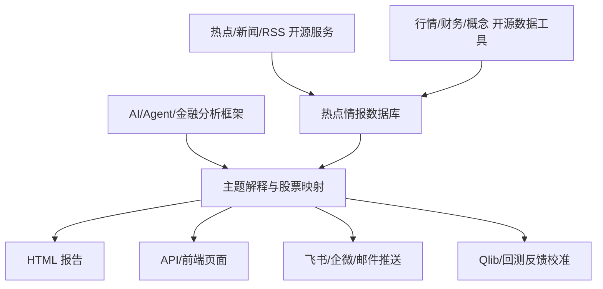

我会把选型从“第一版 MVP”扩成“全功能版路线图”，重点是每个功能优先跑哪个开源项目、怎么评估效果、什么时候再定制开发。先补一眼本地已有 reference 项目，避免漏掉你已经拉下来的可复用资产。

Ran terminal command:  find references -maxdepth 2 \( -name README.md -o -name pyproject.toml -o -name package.json -o -name docker-compose.yml -o -name docker-compose.yaml \) | sed -n '1,180p'

Searched for files matching `ytrader` · `references/*/README*`, 25 matches

Searched for regex `docker compose|docker-compose|quick start|快速开始|install|部署|API|MCP|A股|akshare|tushare` (`**/references/{TrendRadar,TradingAgents,TradingAgents-CN,FinGPT,OpenBB,qlib,Vibe-Trading,firefly-iii}/README*`), 120 results

Completed: *Present system design* (4/7)

对，这样做更合理：**先跑现成项目看效果，再决定哪些地方值得定制开发**。我建议把目标从“选一个底座”改成“开源项目拼装验证矩阵”。

下面是全功能选型，不只第一版。

**总体原则**

每个能力先找成熟开源项目跑起来，观察 3 件事：

- 数据质量：有没有用、是否及时、是否覆盖 A 股热点
- 接入成本：API、Docker、SDK、脚本哪个最快
- 定制价值：现成项目够用就只做适配，不够用再改造

系统最终形态是：

**1. 热点与新闻源**

| 功能 | 优先复用项目 | 运行方式 | 用途 |
|---|---|---|---|
| 综合实时热点新闻 | `ourongxing/newsnow` | 先跑服务或直接调公开 API | 综合新闻、实时热点入口 |
| 社会热榜 | `imsyy/DailyHotApi` | Docker/Vercel/本地服务 | 微博、知乎、百度、B站等热榜 |
| RSS 统一接入 | `DIYgod/RSSHub` | Docker 独立服务 | AI 官方博客、科技媒体、公告、长尾网站 |
| 热点日报/推送 | `TrendRadar` | 已在 TrendRadar | 复用采集、过滤、日报、通知、MCP 思路 |
| RSS 阅读/订阅体验 | `FreshRSS` / `Miniflux` / `Folo` | 独立服务 | 先人工看源质量，后面再自动化接入 |

建议：`NewsNow + DailyHotApi + RSSHub + TrendRadar` 都跑起来。它们不是互斥关系，分别解决“新闻热点、社会热榜、RSS 长尾、报告推送”。

**2. AI 最新消息科普信息源**

| 功能 | 优先复用项目 | 用途 |
|---|---|---|
| AI 官方博客 RSS | `RSSHub` | OpenAI、Anthropic、Google、Meta、NVIDIA 等 |
| 技术社区趋势 | `RSSHub` / HN RSS / GitHub Trending | 捕捉模型、框架、芯片、开源项目趋势 |
| 论文趋势 | `arXiv` RSS / Papers with Code | AI 论文和方向变化 |
| 开源项目热度 | GitHub Trending / `RSSHub` | 捕捉新模型、新 Agent 框架、新基础设施 |
| 科普摘要 | `deer-flow` / LLM 摘要链路 | 把技术新闻转成普通人能懂的解释 |

这里不建议自己写爬虫，第一阶段全走 RSSHub / RSS / GitHub / HN 这类现成源。

**3. A 股市场数据**

| 功能 | 优先复用项目 | 用途 |
|---|---|---|
| A 股行情、板块、资金流、龙虎榜 | `AKShare` | 免费主力数据源 |
| A 股基础信息、财务、日线 | `Tushare` | 有 token 就接，没 token 先留接口 |
| 股票实时行情兜底 | `Ashare` | 简单行情接口备用 |
| 港美股行情 | `yfinance` / `OpenBB` | 后续扩展港股、美股 |
| 多市场统一数据层 | `OpenBB` | 中后期整合全球市场、宏观、ETF |
| 交易/实盘接口 | `vn.py` | 如果未来要接真实交易或仿真交易，再评估 |

建议：A 股第一优先跑 `AKShare`，然后跑 `Tushare`。`OpenBB` 和 `vn.py` 先作为后续扩展，不急着进入第一轮效果验证。

**4. 热点到股票映射**

| 功能 | 优先复用项目/方式 | 用途 |
|---|---|---|
| 主题词库 | 自建 YAML/JSON + AKShare/Tushare 概念数据 | 主题 -> 行业/概念/股票候选 |
| 概念/板块数据 | `AKShare` / `Tushare` | 获取概念成分股、行业成分股 |
| 语义补充 | LLM | 从新闻里抽取新主题、新产业链词 |
| 多角色解释 | `TradingAgents` / TradingAgents-CN | 参考新闻分析师、基本面分析师、风险分析师结构 |
| 股票研究报告 | `TradingAgents-CN` / `FinRobot` | 后续做个股/板块专题分析 |

这里我建议：**规则词库和概念数据负责股票候选，LLM 负责解释和补充，不让 LLM 单独拍脑袋选股**。

**5. 金融 NLP / 情绪 / 摘要**

| 功能 | 优先复用项目 | 用途 |
|---|---|---|
| 金融情绪分析 | `FinGPT` | 金融新闻情绪、风险语气、事件倾向 |
| 金融 Agent 分析 | `FinRobot` | 研究报告、财务分析、Agent 工作流 |
| 多智能体交易研究 | `TradingAgents` / `TradingAgents-CN` | 分析结构和报告结构 |
| 通用中文摘要 | 当前 LLM API / 本地模型 | 新闻压缩、科普解释、逻辑链提取 |
| RAG/工作流 | `deer-flow` | 深度研究、资料汇总、长报告生成 |

建议先不训练模型，先跑 prompt + API。`FinGPT` 更适合参考金融情绪和数据集思路，等第一轮报告有历史样本后再评估是否接本地模型。

**6. 热点情报数据库**

| 功能 | 优先选型 | 说明 |
|---|---|---|
| 主数据库 | PostgreSQL | 结构化保存新闻、事件、主题、股票映射 |
| 向量检索 | pgvector | 存新闻摘要、事件 embedding，方便相似事件检索 |
| 缓存/任务状态 | Redis | 采集状态、去重、任务队列 |
| 全文搜索 | PostgreSQL FTS，后续可接 Elasticsearch | 第一阶段先别引入太重 |
| 对象存储 | 本地文件，后续 MinIO | 保存 HTML、截图、原始快照 |

这个部分不建议完全交给外部项目，因为这是你的核心资产：情报、事件、股票映射、评分、反馈都要沉淀到自己的库里。

**7. 报告与可视化**

| 功能 | 优先复用项目/库 | 用途 |
|---|---|---|
| 本地 HTML 报告 | `TrendRadar` 报告思路 + Jinja2 | 先出可读结果 |
| 图表 | ECharts | 主题热度、板块热力、时间线 |
| Markdown/PDF 导出 | `TrendRadar` 思路 / WeasyPrint / Playwright | 后续导出 |
| 前端页面 | 现有 frontend 工程 / Vite / React | 第二阶段做页面 |
| 金融仪表盘参考 | `OpenBB Workspace` / `Vibe-Trading` | 参考交互，不一定直接复用 UI |

第一步就生成 HTML，不必先做完整前端。HTML 能稳定产出后，再把同一份 JSON 数据喂给前端。

**8. 推送与自动化**

| 功能 | 优先复用项目 | 用途 |
|---|---|---|
| 多渠道推送 | `TrendRadar` | 企微、飞书、Telegram、邮件、Bark、ntfy 等 |
| 通用推送库 | `Apprise` | 如果 TrendRadar 的推送不够统一，可以补 |
| 定时调度 | 现有 scheduler.py / APScheduler | 接入 ytrader 后端 |
| 工作流编排 | GitHub Actions / cron / Docker Compose | 私人使用先简单可靠 |
| MCP 接入 | `TrendRadar MCP` / `Vibe-Trading MCP` | 让 AI 助手能查热点和行情 |

建议：推送别重写，先复用 TrendRadar 的适配经验。等报告稳定后，再接飞书/企微/邮件。

**9. 盘中雷达**

| 功能 | 优先复用项目 | 用途 |
|---|---|---|
| 盘中行情 | `AKShare` / `Ashare` | 个股、板块、指数实时数据 |
| 热榜刷新 | `DailyHotApi` / `NewsNow` | 社会热点变化 |
| 新闻增量 | `RSSHub` / `TrendRadar` | 新文章、新公告 |
| 实时界面 | `Vibe-Trading` / 自有前端 | 参考 SSE/API/Web UI |
| 事件提醒 | TrendRadar 推送 + 自己的规则 | 盘中触发提示 |

这个是第二阶段，不要放在盘前报告之前做。先验证“盘前报告有没有价值”，再做实时化。

**10. 个股/板块专题分析**

| 功能 | 优先复用项目 | 用途 |
|---|---|---|
| 个股多维分析 | `TradingAgents-CN` | A 股/港股/美股多角色分析 |
| 金融报告生成 | `FinRobot` / `FinGPT` | 财报、新闻、情绪分析 |
| 行情和基本面 | `AKShare` / `Tushare` / `OpenBB` | 数据底座 |
| 研报式输出 | `deer-flow` | 长文研究和资料整理 |
| 交互式分析 | MCP / 后端 API | 输入股票代码生成专题报告 |

这个后续可以直接做成：“输入股票代码/概念 -> 拉新闻、公告、行情、财务 -> 多 Agent 出报告”。

**11. 回测与反馈校准**

| 功能 | 优先复用项目 | 用途 |
|---|---|---|
| 热点评分验证 | `Qlib` | 验证主题/股票池与后续收益关系 |
| 策略回测 | `backtrader` / `Qlib` / 现有 ytrader backtester | 轻量策略用现有，复杂研究用 Qlib |
| 因子研究 | `Qlib` | 热度、情绪、资金、新闻密度作为因子 |
| 组合模拟 | `Vibe-Trading` / ytrader | 参考多市场组合和报告 |
| 交易系统扩展 | `vn.py` | 后续接实盘/仿真 |

建议：Qlib 不要第一天就接。先积累 2-4 周的盘前报告和行情反馈，再用 Qlib 验证哪些评分有效。

**建议的运行验证顺序**

第一轮只跑项目，看效果，不定制：

1. 跑 `DailyHotApi`：确认社会热榜质量。
2. 跑 `NewsNow`：确认综合新闻热点质量。
3. 跑 `RSSHub`：接 AI 官方博客、HN、GitHub、arXiv。
4. 跑 `TrendRadar`：看日报、AI 分析、通知、MCP 能复用多少。
5. 跑 `AKShare`：确认 A 股行情、板块、概念、资金数据。
6. 跑 `TradingAgents-CN`：看 A 股分析报告效果。
7. 跑 `Vibe-Trading`：看它的 API、MCP、多数据源、Web UI 有没有可抄的结构。
8. 跑 `OpenBB`：评估港美股/全球市场扩展价值。
9. 跑 `Qlib`：等有历史热点数据后再做评分验证。

**最终选型分层**

| 层 | 主选 | 备选/后续 |
|---|---|---|
| 热点新闻 | NewsNow, TrendRadar | RSSHub |
| 社会热榜 | DailyHotApi | TrendRadar 平台源 |
| AI 科技源 | RSSHub | HN/GitHub/arXiv 直连 |
| A 股数据 | AKShare | Tushare, Ashare |
| 港美股数据 | OpenBB, yfinance | Futu, AKShare |
| 多 Agent 分析 | TradingAgents-CN | FinRobot, deer-flow |
| 金融 NLP | FinGPT | 通用 LLM |
| 报告生成 | TrendRadar + Jinja2/ECharts | 自研前端 |
| 推送 | TrendRadar | Apprise |
| MCP/AI 查询 | TrendRadar MCP, Vibe-Trading MCP | 自研 MCP |
| 回测校准 | Qlib | ytrader/backtrader |
| 交易扩展 | vn.py | Futu/券商 API |

我的建议是：下一步 spec 不写成“我要开发什么功能”，而写成 **“开源项目试跑与复用评估计划”**。先把每个项目跑起来，给每个项目打分：数据质量、稳定性、接入难度、定制价值。等试跑结果出来，再进入真正的定制开发计划。